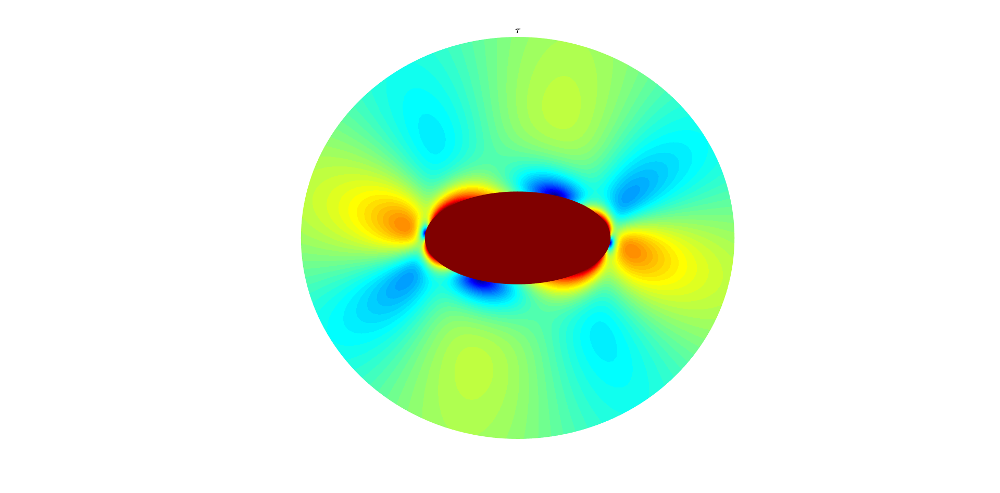

# Muskhelishvili

Muskhelishvili's method applied to elliptical and lubricated circular inclusions in general shear. Analytical solutions implemented in Matlab.

This is a clone of our orginal collection of Muskhelishvili Matlab scripts from: 
["Muskhelishvili's method applied to elliptical and lubricated circular inclusions in general shear"
by Dani Schmid and Yuri Podladchikov, doi:10.3929/ethz-a-004398265](https://www.research-collection.ethz.ch/handle/20.500.11850/146738). 

### Getting Started
Download the Matlab scripts as a zip, unpack on your computer, and explore them. 

 ### Authors

* Dani Schmid
* Yuri Podladchikov